# Overdrip

Automate plant watering on your Raspberry Pi. Configure devices, manage watering schedules, and monitor plant health from the command line.

## Quick Start

### Prerequisites

- Bun v1.3+ ([install](https://bun.sh))
- A Raspberry Pi (3B+ or newer recommended)

### Installation

Once distributed:

```bash
curl -sSL https://get.overdrip.app | bash
```

For development, use from source:

```bash
bun install
cd packages/cli
bun run src/index.ts --help
```

### Get Started

```bash
# Interactive setup
drip init

# Specify custom config path
drip init -p /custom/path/config.json

# Show configuration
drip config show

# Start watering system
drip start
drip start --detach  # Run in background
```

Configuration is stored at `~/.overdrip/config.json` by default.

## Features

- 🌱 **Web-first setup** — Authenticate with email/password, register devices
- 🔐 **Secure device auth** — Devices authenticate with custom Firebase tokens
- 📱 **Stateful config** — Local configuration persists across reboots
- 📊 **Future: Backend stats** — Monitor watering history and plant health

## What's Next

- Device runtime with GPIO control
- Watering schedule management
- Cloud dashboard (Firebase Firestore)
- Mobile companion app (planned)

## Development

To contribute:

```bash
bun install                                     # Install all packages
bun test                                        # Run tests
cd packages/cli && bun run lint                 # Lint
cd packages/cli && NODE_ENV=production bun run build  # Build for production
```

See [`.github/copilot-instructions.md`](.github/copilot-instructions.md) for architecture details and development patterns.

## Hardware

- **Overview:** Overdrip targets Raspberry Pi with two plant slots wired to an ADS1115 ADC (soil moisture sensors) and two GPIO-driven pumps.
- **Auto-detection:** The runtime selects hardware based on `config.hardwareMode?: "mock" | "detect"` (default: `detect`). Detection checks platform/`/proc/device-tree/model` for Raspberry Pi. Real interfaces are TBD; mocks are used until implemented.
- **Slots & mapping:** Hardware interfaces are initialized once and reused. Plant configs are merged with slots by order.
  - Slot 0: ADS1115 channel A0 (sensor) + GPIO 17 (pump)
  - Slot 1: ADS1115 channel A1 (sensor) + GPIO 27 (pump)
- **Wiring guide:**
  - Connect ADS1115 to Pi via I2C (SDA to GPIO 2, SCL to GPIO 3, 3V3 and GND as appropriate).
  - Soil moisture sensors output analog voltage → wire to ADS1115 inputs A0 and A1, share GND/3V3 per sensor specs.
  - Pumps should be driven via a MOSFET/transistor driver with flyback diode; control lines from Pi GPIO 17 and 27, separate power supply for pumps recommended.
- **Runtime behavior:** Watering config is reloaded each loop; hardware slots are not recreated. The loop interval comes from `device.checkIntervalMs` (optional; defaults to 5000ms).

### Wiring diagrams (Mermaid)

#### I2C: Pi ↔ ADS1115 ↔ Sensors


#### Pump control (per pump)

```mermaid
flowchart LR
  subgraph Pi["Raspberry Pi"]
    gpio17["GPIO 17 → Pump 1"]
    gpio27["GPIO 27 → Pump 2"]
    gndPi["GND"]
  end

  subgraph Driver1["Pump 1 driver (N-MOSFET)"]
    gate1["Gate (100–220Ω)"]
    pd1["Gate pull-down (100kΩ)"]
    fet1["MOSFET"]
  end

  subgraph Driver2["Pump 2 driver (N-MOSFET)"]
    gate2["Gate (100–220Ω)"]
    pd2["Gate pull-down (100kΩ)"]
    fet2["MOSFET"]
  end

  subgraph Pump1["Pump 1"]
    p1p["Pump +"]
    p1n["Pump −"]
  end

  subgraph Pump2["Pump 2"]
    p2p["Pump +"]
    p2n["Pump −"]
  end

  subgraph Supply["Pump supply (fused)"]
    vplus["+V"]
    vminus["GND (common)"]
  end

  %% Pump 1 path
  gpio17 --- gate1
  gate1 --- fet1
  pd1 --- gndPi
  fet1 --- p1n
  vplus --- p1p
  vminus --- gndPi
  vminus --- p1n
  p1p -. flyback diode (1N4007/1N5819) .- p1n

  %% Pump 2 path (mirrors Pump 1)
  gpio27 --- gate2
  gate2 --- fet2
  pd2 --- gndPi
  fet2 --- p2n
  vplus --- p2p
  vminus --- gndPi
  vminus --- p2n
  p2p -. flyback diode (1N4007/1N5819) .- p2n
```



### Safety & Power

- Recommended driver: logic-level N-MOSFET (e.g., IRLZ44N, IRLZ34N) with gate resistor (100–220Ω) and pull-down (100k) to prevent floating gates.
- Flyback diode across pump leads (e.g., 1N4007 or Schottky like 1N5819) oriented to clamp inductive kick.
- Separate pump power supply sized for pump current; fuse the supply line appropriately.
- Common ground between Raspberry Pi, driver circuits, and pump supply; keep high-current returns away from Pi signal ground routing.
- If any peripherals are 5V, ensure level shifting and never apply 5V to Pi GPIO directly.
- ADS1115 breakout boards typically include I2C pull-ups; if using bare ADC IC, add ~4.7k–10k pull-ups on SDA/SCL.

## License

This project is licensed under the MIT License. See [LICENSE](LICENSE) for details.
